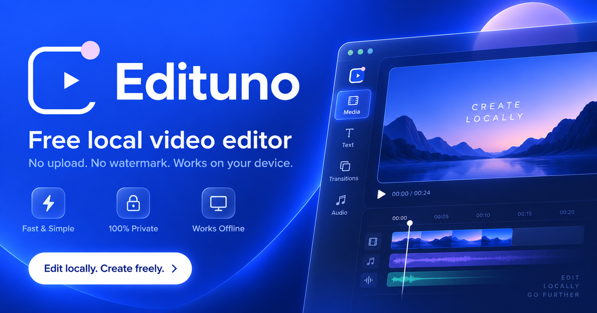

<div align="center">



# Edituno

### A local-first video editor for the web

**Edit video, audio, text, overlays, effects and transitions directly on your device.  
No uploads. No watermark. Installable as a PWA.**

[](https://donacgreece.github.io/Edituno/)
[](https://donacgreece.github.io/Edituno/)
[](https://www.typescriptlang.org/)
[](./LICENSE.md)

**Current release: v2.9.6**

[Release history and changelog](./RELEASE_NOTES.md)

</div>

---

## What is Edituno?

Edituno is a browser-based video editor designed around a simple principle:

> **Your media should stay on your device.**

Instead of uploading footage to a remote editing service, Edituno runs the editing workflow locally in the browser. Projects, previews, smart analysis and export are handled on-device whenever the browser supports the required capabilities.

The goal is to bring together the speed of a lightweight mobile editor with the control of a desktop timeline, while keeping the experience installable, private and easy to use.

---

## Why Edituno?

- **Local-first editing**  
  Video, images and audio remain on the user's device during the normal editing workflow.

- **No mandatory account**  
  Start editing without creating an online account.

- **No watermark**  
  Exported projects are not branded with an Edituno watermark.

- **Installable PWA**  
  Runs from the browser or installs like an app on supported desktop and mobile platforms.

- **Mobile and desktop workflows**  
  The same project model is presented through a compact mobile interface and a more complete desktop workspace.

- **Real editing tools, not a template generator**  
  Timeline editing, transforms, filters, GPU effects, transitions, audio layers, text, elements and smart tools are part of the editor itself.

---

## Editing features

### Timeline

- Multi-clip video timeline
- Split at playhead
- Duplicate and delete clips
- Timeline zoom
- Snap-to-timeline behavior
- Audio waveforms
- Multiple overlay lanes
- Independent audio track
- Drag and resize timeline items
- Beat and silence guides

### Video and image

- Scale
- Position
- Rotation
- Crop / cover / contain behavior
- Horizontal and vertical flip
- Opacity
- Playback speed
- Audio volume
- Fade in / fade out
- Motion presets
- Color and image adjustments

### Text

- Multiple text layers
- Font size and styling
- Alignment
- Color and background controls
- Position
- Scale
- Rotation
- Direct manipulation inside the preview
- Persistent transforms in preview and export

### Overlays and elements

- Video and image overlays
- Stickers and visual elements
- Searchable Fluent Emoji element library
- Direct canvas selection
- Drag
- Resize
- Rotate
- Center snapping
- Rule-of-thirds snapping

### Captions

- Caption workflow
- SRT subtitle import
- Timeline-aware subtitle rendering

---

## GPU effects

Edituno includes a GPU-assisted effects pipeline powered by:

- **PixiJS 8.20.1**
- **PixiJS Filters 6.1.5**

Available effect modes include:

- Bloom
- Glitch
- CRT
- Old Film
- RGB Split
- Pixelate
- Bulge
- Dream Blur

Effects are integrated into both preview rendering and the Edituno export pipeline.

When GPU rendering is unavailable, Edituno falls back to Canvas-based rendering where possible.

---

## Shader transitions

Edituno includes selected MIT-licensed transitions from the `gl-transitions` ecosystem:

- Cross Zoom
- Swirl
- Mosaic
- Circle Crop
- Directional
- Dreamy

These transitions use true two-frame WebGL compositing instead of simple CSS animations.

If WebGL is unavailable, the editor falls back gracefully instead of breaking the project.

---

## Smart Tools

### Auto Reframe

Powered by **Smartcrop.js 2.0.5**.

Edituno analyzes visual content and adjusts the crop for the active project aspect ratio.

For video clips, Edituno samples multiple points in the clip instead of relying on a single frame, then maps the result into Edituno's own scale and offset system.

Supported project formats include:

- 16:9
- 9:16
- 1:1
- 4:5

### Smart Audio

Powered by **Meyda 5.6.3**.

Audio analysis runs locally and can provide:

- Beat detection
- BPM estimation
- Silence detection
- Silence duration
- Beat markers
- Silence markers
- Configurable beat-cut density
- Automatic cuts on the primary video track

No cloud audio analysis is required for these tools.

---

## Direct canvas editing

Edituno uses **Konva 10.5.0** as an interaction layer for manipulating objects directly inside the preview.

You can:

- Click an object to select it
- Drag it directly
- Resize from corner handles
- Rotate using a dedicated handle
- Snap rotation to common angles
- Snap to center lines
- Snap to rule-of-thirds guides

Konva handles interaction only. Final project rendering remains inside Edituno's own rendering pipeline.

---

## Export

Edituno includes a browser-local export pipeline built around:

- Canvas and WebGL composition
- Deterministic fixed-frame timeline rendering
- WebCodecs H.264/AVC video encoding
- OfflineAudioContext timeline mixing
- WebCodecs AAC audio encoding
- Timestamped MP4 muxing with mp4-muxer
- MediaRecorder compatibility fallback
- Post-export validation

Current quality presets include:

- 720p
- 1080p
- 4K / 2160p when supported by the browser and device

The actual output container and codec depend on browser support.

> Browser media capabilities vary between platforms. Edituno detects supported recording formats at runtime and uses the best available option.

---

## Light and dark themes

Edituno includes:

- System theme
- Dark mode
- Light mode

Theme selection is stored locally and the PWA/browser theme color updates with the active appearance.

---

## Languages

The interface currently supports:

- Greek
- English

---

## Privacy

Edituno is designed as a local-first editor.

During the normal editing workflow:

- Media is imported from the user's device
- Project data is stored locally
- Smartcrop analysis runs locally
- Meyda audio analysis runs locally
- Preview rendering runs locally
- Export runs locally

Edituno does not require users to upload their project media to an Edituno server in order to edit a project.

---

## Progressive Web App

Edituno can be installed as a PWA on supported platforms.

### Android and desktop

Supported browsers can use the native PWA install prompt.

### iPhone and iPad

Edituno provides platform-specific Add to Home Screen guidance when a native install prompt is unavailable.

The installed version keeps the same local-first project workflow as the browser version.

---

## Tech stack

| Area | Technology |
|---|---|
| Language | TypeScript |
| UI | Vanilla browser UI |
| Rendering | Canvas 2D + WebGL |
| GPU effects | PixiJS + PixiJS Filters |
| Transitions | gl-transitions |
| Smart framing | Smartcrop.js |
| Audio analysis | Meyda |
| Canvas interaction | Konva |
| Safari audio export | libav.js / FFmpeg WebAssembly |
| MP4 muxing | Mediabunny + mp4-muxer compatibility path |
| Storage | Browser local storage / IndexedDB-style local project storage |
| App model | Progressive Web App |
| Deployment | GitHub Pages + GitHub Actions |

---

## Architecture

Edituno deliberately keeps the editor architecture lightweight.

```text
User media
   │
   ▼
Local project storage
   │
   ├── Timeline model
   ├── Video / image clips
   ├── Audio tracks
   ├── Text layers
   ├── Overlays
   └── Elements
   │
   ▼
Edituno renderer
   │
   ├── Canvas 2D
   ├── PixiJS effects
   ├── WebGL transitions
   ├── Konva interaction layer
   └── Smart analysis tools
   │
   ▼
Local export pipeline
```

The interaction layer and the final renderer are intentionally separated.  
For example, Konva is used for manipulation handles, while Edituno's own renderer remains responsible for the exported result.

---

## Run locally

### Requirements

- Node.js 22 or newer recommended
- npm
- Modern Chromium, Edge, Chrome, Safari or Firefox-based browser with the required media APIs

### Install

```bash
git clone https://github.com/Donacgreece/Edituno.git
cd Edituno
npm install
```

### Build

```bash
npm run build
```

### Serve the production build

```bash
npm run serve
```

Then open:

```text
http://localhost:4173
```

---

## Project structure

```text
Edituno/
├── src/
│   ├── app.ts
│   ├── styles.css
│   └── index.template.html
│
├── public/
│   ├── icons/
│   ├── splash/
│   ├── og/
│   ├── vendor/
│   └── sw.js
│
├── THIRD_PARTY_LICENSES/
├── dist/
├── tools/
│   └── build.mjs
│
├── .github/
│   └── workflows/
│       └── deploy-pages.yml
│
├── LICENSE.md
├── LICENSE_SCOPE.md
├── THIRD_PARTY_NOTICES.md
├── OPEN_SOURCE_STACK.md
└── RELEASE_NOTES.md
```

---

## Build and deployment

The repository includes a GitHub Actions workflow that:

1. installs pinned dependencies
2. verifies editing engine versions
3. resolves the active GitHub Pages/custom domain
4. prepares vendor assets
5. builds the production bundle
6. validates SEO, PWA and licensing files
7. deploys `dist/` to GitHub Pages

The production domain is resolved dynamically, so canonical URLs, Open Graph metadata, `robots.txt`, `sitemap.xml` and `llms.txt` can follow the active Pages domain without hardcoding it into the source.

---

## Discoverability

Edituno includes a complete metadata layer for search engines, social sharing and AI-readable project discovery:

- Canonical URL
- Open Graph metadata
- Twitter cards
- `SoftwareApplication` structured data
- `robots.txt`
- `sitemap.xml`
- `llms.txt`
- Dedicated 1200×630 social preview image

---

## Roadmap

Edituno is being developed as a serious browser-native editing environment.

Areas of active development include:

- Export reliability across more browser/device combinations
- Better audio editing
- More GPU effects
- More transitions
- Richer text animation
- More advanced smart editing
- Better project recovery
- Performance improvements for longer projects
- Wider codec and container support
- Further mobile editing improvements

---

## Open-source components

Edituno uses several third-party open-source projects.

Notable components include:

- PixiJS
- PixiJS Filters
- gl-transitions
- Smartcrop.js
- Meyda
- Konva
- Microsoft Fluent Emoji
- Lucide-derived icon geometry

Each third-party component keeps its original upstream license.

See:

- [`THIRD_PARTY_NOTICES.md`](./THIRD_PARTY_NOTICES.md)
- [`THIRD_PARTY_SOURCE_OFFER.md`](./THIRD_PARTY_SOURCE_OFFER.md)
- [`PATENT_NOTICE.md`](./PATENT_NOTICE.md)
- [`THIRD_PARTY_LICENSES/`](./THIRD_PARTY_LICENSES/)
- [`OPEN_SOURCE_STACK.md`](./OPEN_SOURCE_STACK.md)
- [`LICENSE_SCOPE.md`](./LICENSE_SCOPE.md)

---

## License

Edituno's **original first-party source code and documentation** are licensed under:

**PolyForm Noncommercial License 1.0.0**

```text
SPDX-License-Identifier: PolyForm-Noncommercial-1.0.0
```

This means the Edituno first-party code is source-available for permitted noncommercial use under the PolyForm terms.

Third-party libraries and assets are **not relicensed by Edituno** and continue to use their own upstream licenses.

Commercial use of Edituno first-party material requires separate permission or a commercial license from the copyright holder.

See:

- [`LICENSE.md`](./LICENSE.md)
- [`LICENSE_SCOPE.md`](./LICENSE_SCOPE.md)
- [`NOTICE`](./NOTICE)
- [`THIRD_PARTY_NOTICES.md`](./THIRD_PARTY_NOTICES.md)

---

## Support the project

Edituno is independently developed.

If you find the project useful and want to support its development:

[](https://www.paypal.com/paypalme/DimitrisGalatsanos)

---

## Links

**Live app**  
https://donacgreece.github.io/Edituno/

**GitHub**  
https://github.com/Donacgreece/Edituno

**Planned domain**  
https://edituno.com/

---

<div align="center">

### Edit locally. Keep your media local. Export when you're ready.

**Edituno**

</div>

### Safari, iPhone and iPad production audio export

Safari/WebKit audible exports use a dedicated LibAV.js / FFmpeg WebAssembly audio backend instead of Safari's native AAC WebCodecs path. Embedded video speech, background music, A1 audio and audible overlays are decoded, trimmed, time-scaled, faded, mixed and AAC-encoded offline by the WASM runtime. The final AAC packets are combined with Edituno's deterministic H.264 video render through Mediabunny.

Source media is exposed to LibAV through seekable readahead files, so long inputs do not need to play in real time. Edituno does not use the old Safari realtime-audio workaround on the production v2.9.1 path. Windows/Chromium keeps the existing working export path.

The LibAV.js / FFmpeg runtime remains a separate LGPL component and Mediabunny remains MPL-2.0. Edituno first-party code remains PolyForm Noncommercial 1.0.0. Exact corresponding source and reproducible build configuration are distributed with the production application. See `THIRD_PARTY_SOURCE_OFFER.md`, `LIBAV_RUNTIME_REPLACEMENT.md`, `LEGAL_COMPLIANCE_LIBAV_AUDIO.md` and `PATENT_NOTICE.md`.
